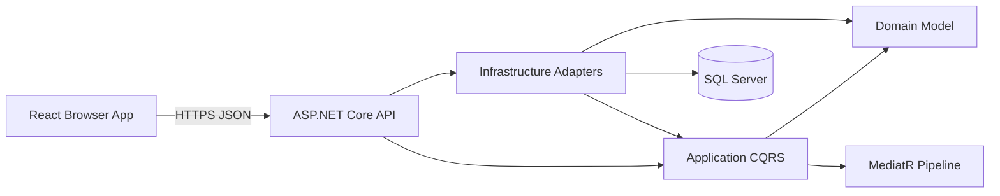

# Architecture

## System Topology
The solution follows Clean Architecture on the backend and feature-first modularity on the frontend. The API is the composition root. Dependencies point inward; infrastructure adapters implement application-owned ports.

## Backend Projects
- **Domain**: aggregates, entities, value objects, domain events, and invariants. No framework or persistence references.
- **Application**: commands/queries, handlers, DTOs, validators, use-case interfaces, and orchestration.
- **Infrastructure**: EF Core context/configuration/migrations and external integrations. Implements Application ports.
- **API**: versioned HTTP controllers, authentication/authorization, middleware, OpenAPI, health, and dependency registration.

## Frontend Modules
- `services/` configures shared transport concerns.
- `providers/`, `routes/`, and `layouts/` compose the application shell.
- `features/<name>/` owns feature API hooks, components, types, and a public `index.ts` surface.
- `components/`, `hooks/`, `types/`, and `utils/` contain only genuinely cross-feature primitives.
- TanStack Query owns server state. Keep ephemeral presentation state local; use the global store only for cross-route client state.

## Request Lifecycle
1. The browser calls a typed feature API hook. TanStack Query applies cache, retry, and stale-time policy.
2. Axios sends JSON over HTTPS to the API. The API applies CORS, rate limiting, authentication, authorization, and request validation.
3. A thin controller binds the transport contract and dispatches a MediatR command/query with cancellation.
4. Application validation and behaviors run before the handler. The handler enforces use-case rules through Domain types and Application ports.
5. Infrastructure adapters persist through EF Core or call external systems. Transactions are scoped to a use case when required.
6. The API maps the result to a stable DTO/status code. Central exception handling emits Problem Details; structured logs retain trace context.
7. The browser renders loading, success, empty, and error states. Cache invalidation follows successful mutations.

## Boundaries and Decisions
- HTTP contracts do not expose persistence entities.
- PostgreSQL is the default provider; provider-specific code stays in Infrastructure.
- The health endpoint retains the `/api/v1` route. Employee Management uses the requested `/api/employees` route.
- Employee Management currently targets SQL Server; provider alternatives require separate adapters and migrations.
- Health endpoints are process-level examples. Add dependency checks and separate liveness from readiness semantics before production.
- Authentication integration is intentionally deployment-specific; wire a trusted OIDC provider and policies before exposing protected business data.
