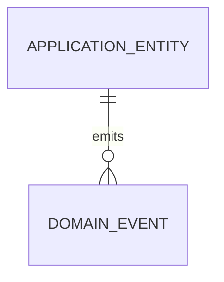

# Database Guide

## Data Model
No business ERD is imposed by the starter. Define bounded-context aggregates and their relationships before adding tables. Keep aggregate boundaries small; model many-to-many links explicitly when they carry attributes or lifecycle behavior.

The diagram is conceptual only; domain events may be persisted in an outbox when reliable asynchronous delivery is required. Replace it with the product-specific ERD as entities are introduced.

## Persistence Standards
- Employee Management currently uses SQL Server. Add another provider through a separate Infrastructure adapter and provider-specific migration set rather than branching provider behavior through Domain/Application.
- Configure constraints and indexes explicitly. Match indexes to filters, joins, and order-by patterns; validate with `EXPLAIN ANALYZE` against representative data.
- Store instants as UTC `DateTimeOffset`. Maintain `CreatedAt` and `UpdatedAt`; record actor identifiers only from trusted server context.
- Treat soft deletion as a domain/data-retention decision. Define global filters, uniqueness semantics, restore/reporting behavior, and retention before enabling it.
- Employee follows its requested `DateTime CreatedAt` and `bool IsDeleted` contract; set the timestamp in UTC and apply the active-row filter in EF Core.
- Use concurrency tokens for contested writes, bounded transactions for multi-step invariants, and database constraints as a final integrity guard.

## Migration Workflow
1. Change entity configuration and model in a focused branch.
2. Generate a named EF Core migration and inspect `Up` and `Down` (or document when rollback is unsafe).
3. Review generated SQL, data backfills, locks, and index-build impact; test against realistic data volume.
4. Apply to an isolated database in CI, then stage. Production migration is an approved release step with backup and monitoring.
5. Prefer expand/migrate/contract for rolling releases. Never run unreviewed migrations automatically on API startup.

Use `dotnet ef migrations add <Name> --project src/backend/Infrastructure --startup-project src/backend/API` after installing the EF CLI. Configure the connection through user secrets or the deployment secret provider.
